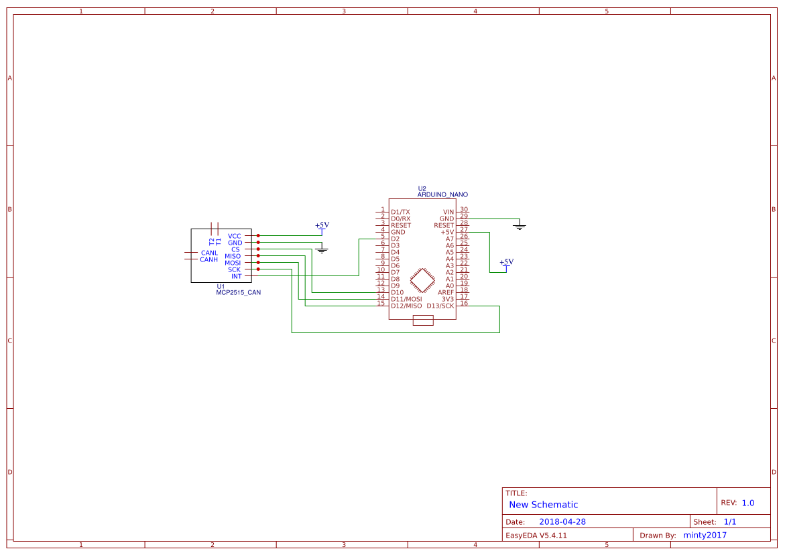
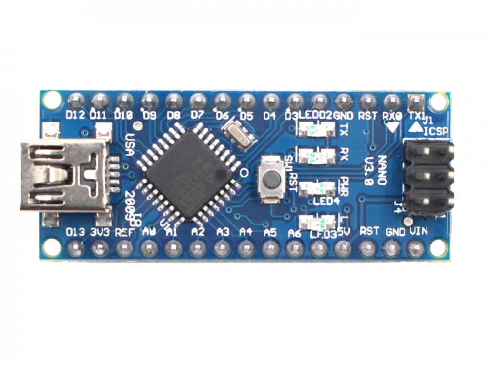
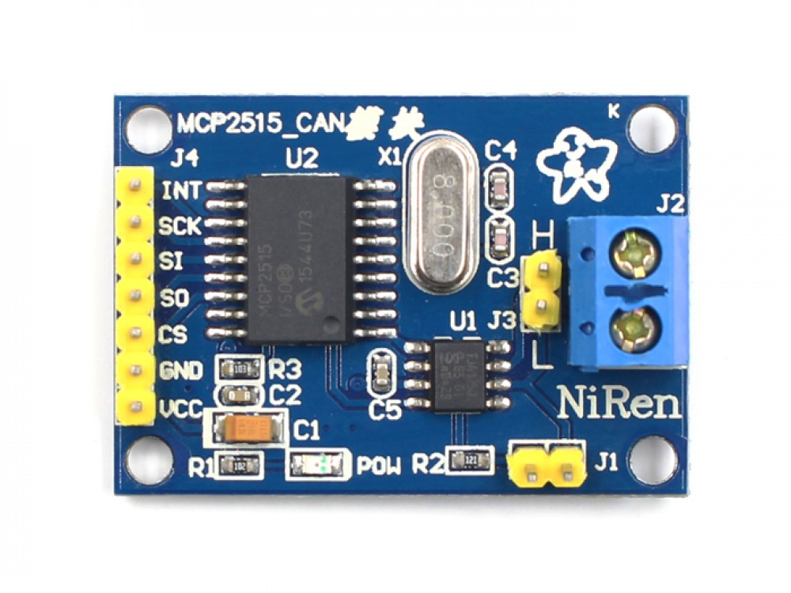
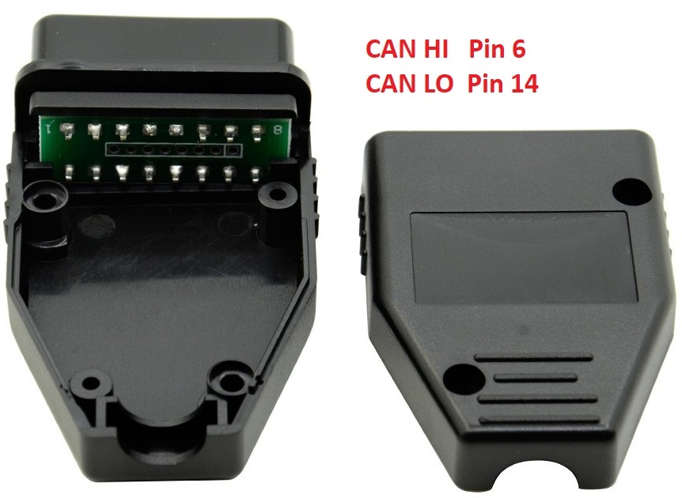
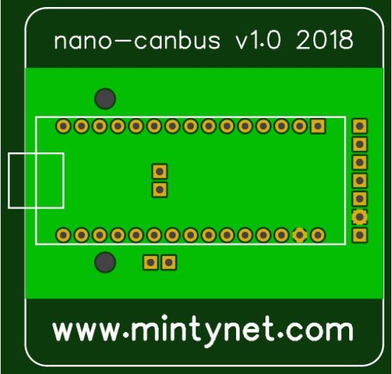
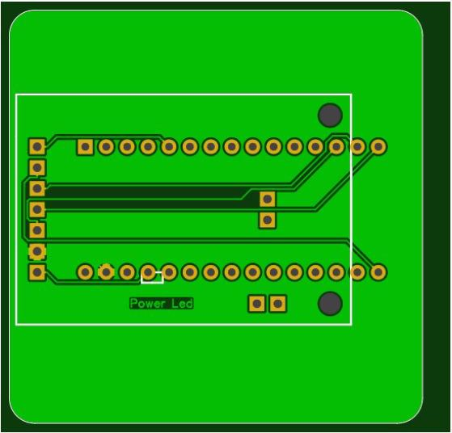

# nano-can
## If you would like a nano-can PCB feel free to contact me on Twitter @mintynet, I don't allow msgs if I do not follow you so just tweet asking me to follow back, I will send if you cover the cost of postage.
If you are looking for the BSides Scotland 2019 Badge please click the following link
 https://github.com/mintynet/BSidesScotland2019
 
 The sketches below will work but the specific build instructions are in the other repository
 
 This repository has the arduino code for use with nano can PCB.
 These were created as a cheap device for people to get into car hacking.
  <b>I take no responsibility for any issues caused if using either the hardware or the code</b>
  Requires the use of the following Arduino library
  https://github.com/coryjfowler/MCP_CAN_lib
  The <b>can-receive-all</b> sketch is the receive example from the above library which will show all messages on the CAN bus. CAN speed can be changed from 500kbps.
 CAN messages are shown on the Serial Monitor
 This can be used to find interesting messages
  The <b>nano-can</b> sketch is configured for the OBD2 port speed (500kbps) and will listen to the can bus starting with CAN ID 0x128. Both can be changed in the code.
 Whilst on the Serial Monitor it will show the changes between the messages
  u and d will change the CAN ID up or down by 1
 U and D will change the CAN ID up or down by 16
 h shows the above information
  The <b>nano-slcan</b> sketch is slcan compatible software but the serial chip on the arduino boards I use will only run at 500000bps

 <b>EASY EDA PCB Design files</b>
https://easyeda.com/minty2017/nano-can-2019

 <b>Schematic</b>

Note:
 <b>Arduino Nano</b> goes on the top with the URL on, <b>the square at one end denote the position of the USB connector</b>.

 <b>MCP2515 Module</b> goes on the bottom but <b>DO NOT</b> solder the Terminator Jumper or CAN pin headers to the PCB
 You may require a jumper on the Terminator resistor
 To solder the CAN module to the board, add extra solder to the back of the pins, then heat the pins and push through so that the pins are on the rear, then remove the plastic pin spacer left on the top and add extra solder to the pins. 

 L goes to OBD2 pin 14
 H goes to OBD2 pin 6
#### The PCB may look slightly different to the ones shown in this file, white square indicates the USB end of Nano.
 <b>Completed v1.0 Top</b> 

 <b>Completed v1.0 Bottom</b> 

 <b>OBD2 connector</b> 

#### The PCB may look slightly different to the ones shown in this file, white square indicates the USB end of Nano.
 <b>v1.0 PCB Top</b> 

 <b>v1.0 PCB Bottom</b> 

