# Build instructions
## Tools required
 Soldering Iron
 Solder
 Side cutters
 Wire strippers
 Small screw driver
## Software requirements.
 Arduino IDE
 Requires the use of the following Arduino library
  https://github.com/coryjfowler/MCP_CAN_lib
 If you have the ability to, burn the new Arduino nano bootloader to the board.
  Then program with can-receive-all sketch

## Instructions
 Parts plus 2 core wire is required
 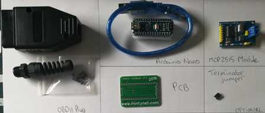
 PCB in holder
 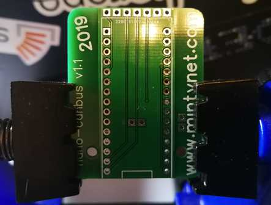
 Board with Arduino nano
 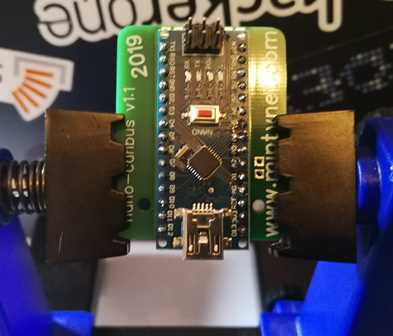
 Board with Arduino nano with additional solder on USB plug
 
 Rear of board with Arduino nano soldered in opposite corners
 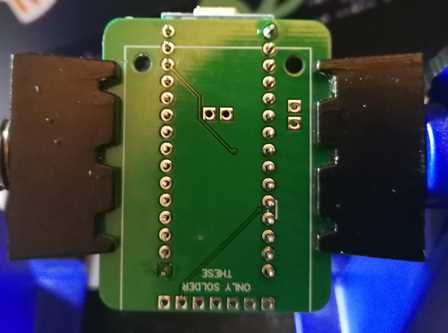
 Rear of board with Arduino nano fully soldered
 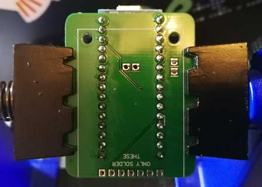
 Rear of board with Arduino nano pins cut short
 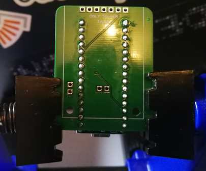
 Rear of board with Arduino nano re soldered
 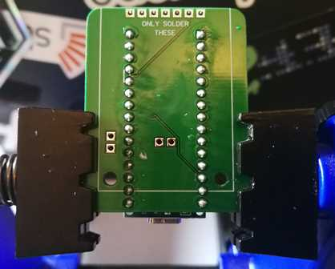
 Made board without pushing pins through
 
 MCP2515 Module rear
 
 MCP2515 some pins pushed through
 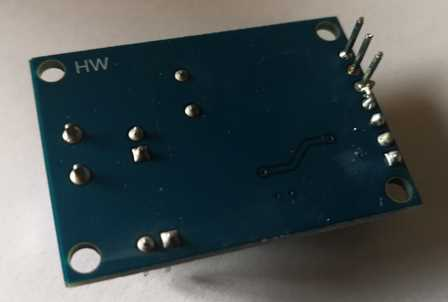
 MCP2515 all pins pushed through
 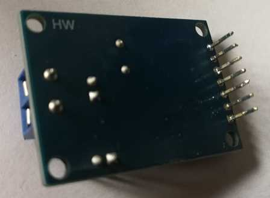
 MCP2515 module in place
 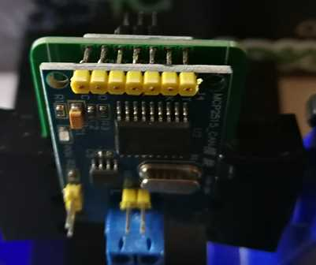
 MCP2515 module ready for solder
 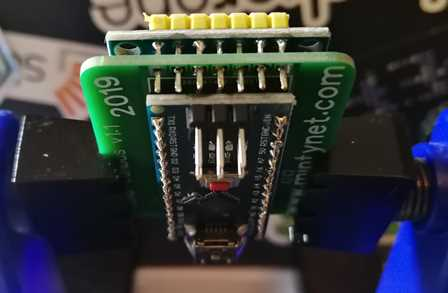
 MCP2515 module top soldered
 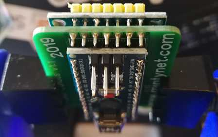
 MCP2515 module without pin header plastic
 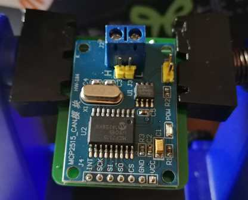
 MCP2515 module rear soldered and terminator jumper
 
 ICSP header without plastic
 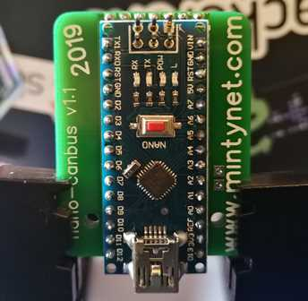
 ICSP header removed
 
 OBD2 plug
 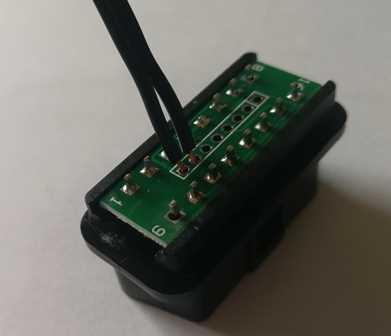
 OBD2 cable and drill
 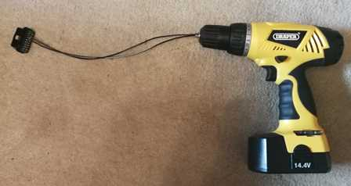
 OBD2 cable twisted pair
 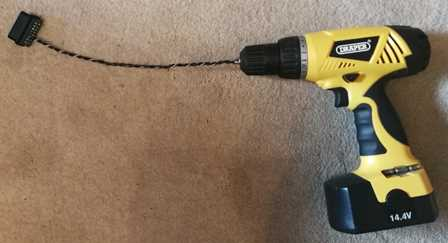
 Complete Top
 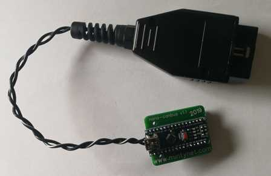
 Complete Rear
 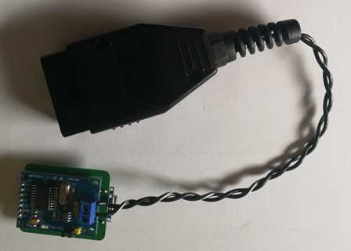
